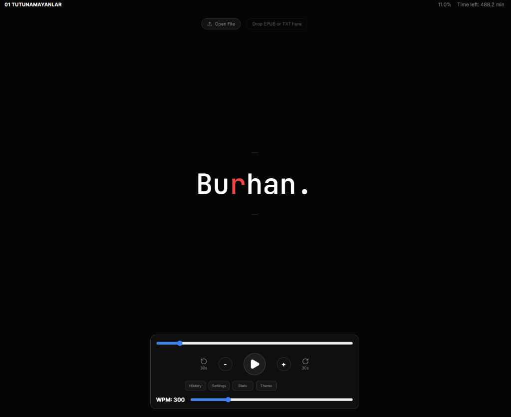
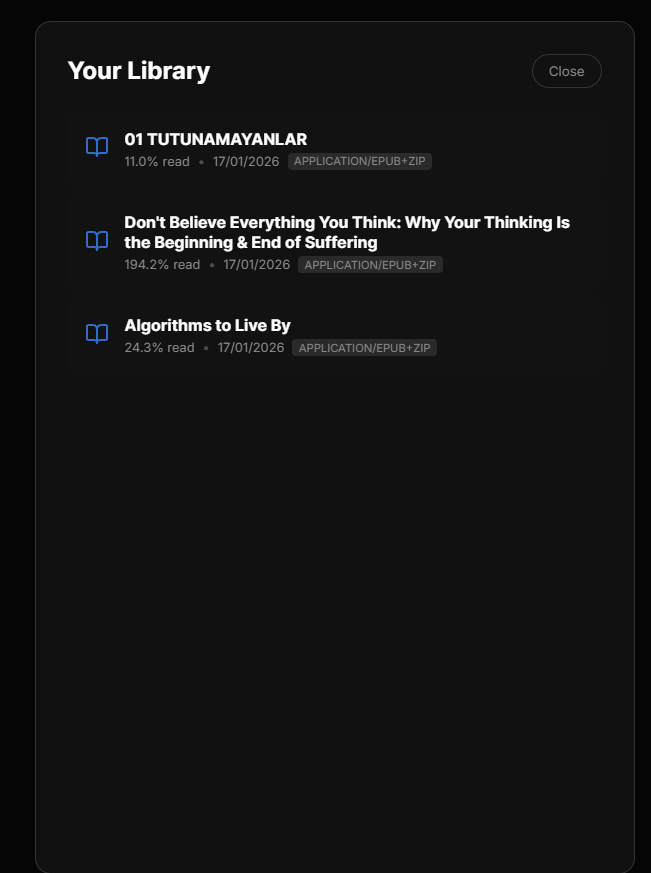
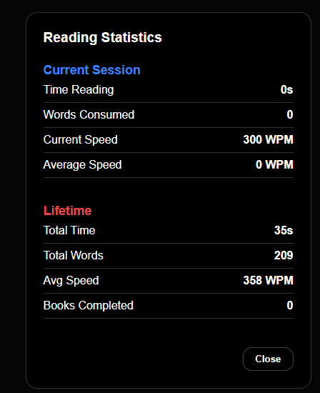

# FastReader ⚡📖

**FastReader** is a modern, privacy-focused speed reading application that leverages the **Rapid Serial Visual Presentation (RSVP)** method. By displaying words one by one at a fixed focal point, it eliminates the need for eye movement (saccades), allowing you to read faster and with less fatigue.

<div align="center">
  
</div>

<div align="center" style="display: flex; gap: 10px; justify-content: center; margin-top: 20px;">
  
  
</div>

## 🚀 The Science of Speed Reading

The reading technique used in FastReader is based on cognitive psychology research from the 1970s (Potter, Forster) known as **RSVP**. 

It was popularized commercially by **Spritz** in 2012, which introduced the concept of the **"Red Optimal Recognition Point" (ORP)**. This aligns each word so your eye stays perfectly still, allowing the brain to process text instantly. While traditional reading caps out around 200-300 WPM for most, RSVP users can often comfortably reach **500+ WPM**.

## ✨ Features

- **⚡ RSVP Engine**: Precision timer with WPM control (100-1000+ WPM).
- **🎯 Optimal Recognition Point**: Red-highlighted focus letter for efficient processing.
- **📚 Local File Support**: Drag & drop **EPUB** and **TXT** files.
- **🔒 Privacy First**: 100% offline. Files are processed locally in your browser and never uploaded to any server.
- **🎨 Beautiful Themes**: Choose from Dark, Light, Vibrant, or Soft palettes.
- **📈 Stats & Analytics**: Track words read, time spent, and average speed.
- **🏋️ Training Mode**: "Auto-Accelerate" feature to gradually increase speed while you read.
- **💾 Auto-Resume**: Remembers exactly where you left off in every book.
- **📱 PWA Support**: Installable on iPhone, Android, and Desktop.

## 🛠️ Technology Stack

- **Framework**: React + TypeScript (Vite)
- **State**: React Hooks + Context
- **Styling**: Vanilla CSS Variables (No external UI frameworks)
- **Storage**: IndexedDB (via `idb`) for large file storage
- **Parsing**: `epubjs` for ebook structure

## 🏃‍♂️ Getting Started

### Prerequisites
- Node.js (v18+)

### Installation

1.  Clone the repository:
    ```bash
    git clone https://github.com/yourusername/fast-reader.git
    cd fast-reader
    ```

2.  Install dependencies:
    ```bash
    npm install
    ```

3.  Run the development server:
    ```bash
    npm run dev
    ```
    Open `http://localhost:5173` (or the network URL provided in the terminal) to view it in the browser.

### Building for Production

To create a production build (PWA ready):

```bash
npm run build
```

The output will be in the `dist/` folder.

## 📝 License

MIT

---

Built by **Ejber Ozkan** using **Gemini Antigravity**.

